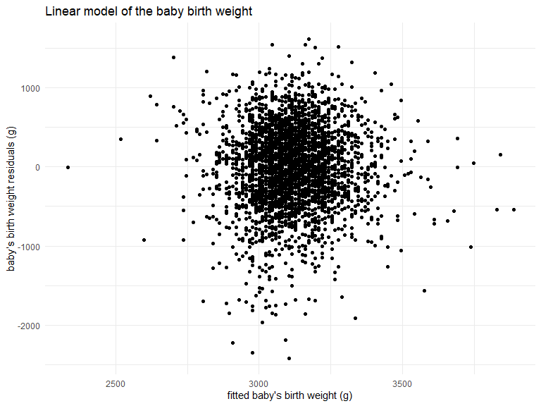
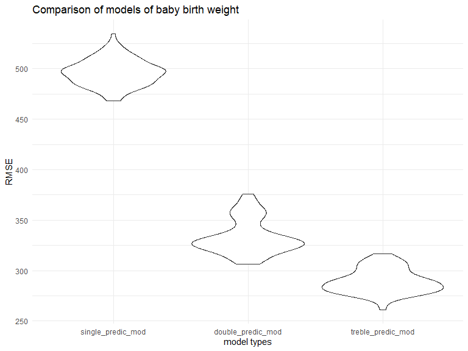

P8105 Homework 6 Solution
================
Xun Wang
11/24/2019

This file is the solution to P8105 Homework 6 from Xun Wang (xw2417).

``` r
library(tidyverse)
library(modelr)
library(mgcv)


knitr::opts_chunk$set(
    echo = TRUE,
    warning = FALSE,
    fig.width = 8, 
  fig.height = 6,
  out.width = "90%"
)

options(
  ggplot2.continuous.colour = "viridis",
  ggplot2.continuous.fill = "viridis"
)

scale_colour_discrete = scale_colour_viridis_d
scale_fill_discrete = scale_fill_viridis_d

theme_set(theme_minimal() + theme(legend.position = "bottom"))

set.seed(1)
```

#### Problem 1

This problem uses the `birthweight` dataset. The code chunk below loads
and cleans the dataset.

``` r
bw_df = 
  read_csv("data/birthweight.csv") %>% 
  janitor::clean_names() %>%
  drop_na() %>% 
  mutate(
    babysex = factor(babysex),
    frace = factor(frace),
    malform = factor(malform),
    mrace = factor(mrace),
    babysex = recode(babysex, "1" = "male", "2" = "female"),
    frace = recode(frace, "1" = "white", "2" = "black", "3" = "asian", "4" = "puerto rican", "8" = "other", "9" = "unknown"),
    malform = recode(malform, "0" = "absent", "1" = "present"),
    mrace = recode(mrace, "1" = "white", "2" = "black", "3" = "asian", "4" = "puerto rican", "8" = "other", "9" = "unknown"),
  )

bw_df
```

    ## # A tibble: 4,342 x 20
    ##    babysex bhead blength   bwt delwt fincome frace gaweeks malform menarche
    ##    <fct>   <dbl>   <dbl> <dbl> <dbl>   <dbl> <fct>   <dbl> <fct>      <dbl>
    ##  1 female     34      51  3629   177      35 white    39.9 absent        13
    ##  2 male       34      48  3062   156      65 black    25.9 absent        14
    ##  3 female     36      50  3345   148      85 white    39.9 absent        12
    ##  4 male       34      52  3062   157      55 white    40   absent        14
    ##  5 female     34      52  3374   156       5 white    41.6 absent        13
    ##  6 male       33      52  3374   129      55 white    40.7 absent        12
    ##  7 female     33      46  2523   126      96 black    40.3 absent        14
    ##  8 female     33      49  2778   140       5 white    37.4 absent        12
    ##  9 male       36      52  3515   146      85 white    40.3 absent        11
    ## 10 male       33      50  3459   169      75 black    40.7 absent        12
    ## # ... with 4,332 more rows, and 10 more variables: mheight <dbl>,
    ## #   momage <dbl>, mrace <fct>, parity <dbl>, pnumlbw <dbl>, pnumsga <dbl>,
    ## #   ppbmi <dbl>, ppwt <dbl>, smoken <dbl>, wtgain <dbl>

If there is any missing data in the cleaned dataset `bw_df`: FALSE.

I would like to propose a simple linear regression model using mother’s
weight gain during pregnancy as predictors. The code chunk below fits
the baby birth weights as an outcome that depends on this predictor.

``` r
linear_mod_general = lm(bwt ~ wtgain, data = bw_df) %>% broom::tidy()

linear_mod_general %>% knitr::kable(digits = 3, caption = "Table 1:  Linear model of baby birth weight predicted by mother weight gain")
```

| term        | estimate | std.error | statistic | p.value |
| :---------- | -------: | --------: | --------: | ------: |
| (Intercept) | 2858.914 |    16.962 |   168.547 |       0 |
| wtgain      |   11.570 |     0.688 |    16.811 |       0 |

Table 1: Linear model of baby birth weight predicted by mother weight
gain

**Comments:** From the simple linear model we can predict, that baby’s
birth weight increases with weight gain of the mother during pregnancy.
And this trend is significant (p = 0). Every pound the mother gains
might increase the baby’s birth weight 11.6 grams.

``` r
train_df = sample_frac(bw_df, size = 0.8)
test_df = anti_join(bw_df, train_df)

mother_weight_gain_mod = lm(bwt ~ wtgain, data = train_df)

train_df %>% 
  add_predictions(mother_weight_gain_mod) %>%
  add_residuals(mother_weight_gain_mod) %>%
  ggplot(aes(x = pred, y = resid)) + 
  geom_point() + 
  labs(
    title = "Linear model of the baby birth weight",
    x = "fitted baby's birth weight (g)",
    y = "baby’s birth weight residuals (g)"
  )
```



**Comments:** The plot above shows model residuals against fitted values
in the simple linear model of baby’s birth weight and mother’s weight
gain. We can see the baby’s birth weight is mostly between 3,000 to
3,250 grams, and the residuals are mostly distributed around 0 from
-1,000 to 1000 grams. The mean residual is 0, which is not far from 0.
So the model is not too bad.

The code chunk below compares my model to two other: \* using length at
birth and gestational age as predictors \* using head circumference,
length, sex, and all interactions between these

``` r
cv_df = 
  crossv_mc(bw_df, 100) %>% 
  mutate(
    train = map(train, as_tibble),
    test = map(test, as_tibble))

cv_df = 
  cv_df %>% 
  mutate(mod_1  = map(train, ~lm(bwt ~ wtgain, data = .x)),
         mod_2  = map(train, ~lm(bwt ~ blength + gaweeks, data = .x)),
         mod_3  = map(train, ~lm(bwt ~ bhead * blength + bhead * babysex + blength * babysex, data = .x))) %>% 
  mutate(rmse_single_predic_mod = map2_dbl(mod_1, test, ~rmse(model = .x, data = .y)),
         rmse_double_predic_mod = map2_dbl(mod_2, test, ~rmse(model = .x, data = .y)),
         rmse_treble_predic_mod = map2_dbl(mod_3, test, ~rmse(model = .x, data = .y)))

cv_df %>% 
  select(starts_with("rmse")) %>% 
  pivot_longer(
    everything(),
    names_to = "model", 
    values_to = "rmse",
    names_prefix = "rmse_") %>% 
  mutate(model = fct_inorder(model)) %>% 
  ggplot(aes(x = model, y = rmse)) + geom_violin() +
  labs(
    title = "Comparison of models of baby birth weight",
    x = "model types",
    y = "RMSE"
  )
```



**Comments:** The plot above shows Root Mean Square Error (RMSE) from 3
different models with single (my model), double and treble predictors.
We can see that predicting baby’s birth weight by only mother’s weight
gain is the least accurate model with the highest RMSE; Building the
model by both baby length at birth and gestational age is more accurate
with lower RMSE; Building the model by head circumference, length, sex,
and all interactions between these gives us the most accurate model with
the lowest RMSE. **So when we build models, the model complexity
shouldn’t be too low.**

#### Problem 2

This problem uses the 2017 Central Park weather data. The code chunk
below loads and cleans the dataset.

``` r
weather_df = 
  rnoaa::meteo_pull_monitors(
    c("USW00094728"),
    var = c("PRCP", "TMIN", "TMAX"), 
    date_min = "2017-01-01",
    date_max = "2017-12-31") %>%
  mutate(
    name = recode(id, USW00094728 = "CentralPark_NY"),
    tmin = tmin / 10,
    tmax = tmax / 10) %>%
  select(name, id, everything())
```

We are focuses on a simple linear regression with `tmax` as the response
and `tmin` as the predictor, and analyzes the distribution of two
quantities estimated from these data. The code chunk below generates the
dataset `boot_straps_df` with these two quantities.

``` r
boot_straps = 
  weather_df %>% 
  bootstrap(n = 3)

boot_straps_df = 
  boot_straps %>% 
  mutate(
    models = map(strap, ~lm(tmax ~ tmin, data = .x) ),
    result_1 = map(models, broom::glance),
    result_2 = map(models, broom::tidy)) %>% 
  select(-strap, -models) %>% 
  unnest(result_1) %>% 
  select(.id, r.squared, result_2) %>% 
  unnest(result_2) %>% 
  select(.id, r.squared, term, estimate) %>% 
  mutate(
    estimate_2 = lead(estimate, 1),
    log_beta0_beta1 = log10(estimate * estimate_2)
    ) %>% 
  filter(term == "(Intercept)") %>% 
  select(.id, r.squared, log_beta0_beta1)

boot_straps_df
```

    ## # A tibble: 3 x 3
    ##   .id   r.squared log_beta0_beta1
    ##   <chr>     <dbl>           <dbl>
    ## 1 1         0.915           0.868
    ## 2 2         0.906           0.884
    ## 3 3         0.917           0.857

``` r
r_squared = pull(boot_straps_df, r.squared)

low_quantile = quantile(r_squared, probs = c(0.025, 0.975))[[1]]
high_quantile = quantile(r_squared, probs = c(0.025, 0.975))[[2]]
```

In the `boot_straps_df` dataset, the 2.5% quantile is 0.9060632 and the
97.5% quantile is 0.9164436.
